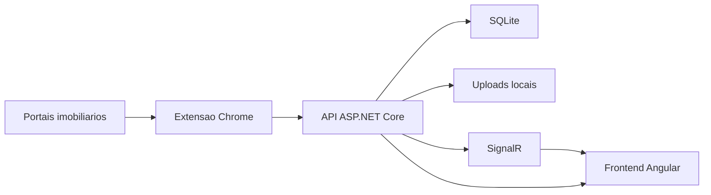

# Casa

Casa e uma plataforma para importar, organizar, analisar e comparar imoveis de aluguel em um so lugar.

## Sobre o projeto

Buscar aluguel em varios portais costuma gerar um processo desorganizado: links espalhados, prints soltos, informacoes incompletas e dificuldade para comparar opcoes com criterio.

O Casa resolve isso centralizando o fluxo inteiro em uma aplicacao unica, com apoio a importacao de anuncios, filtros, mapa, favoritos, analise SWOT, inconsistencias, comparacao entre imoveis, observacoes, midia e logs.

## Objetivo

O objetivo do projeto e ajudar no processo real de decisao sobre aluguel, transformando anuncios espalhados em um painel unico e pratico para:

- registrar imoveis
- comparar opcoes
- acompanhar custos e observacoes
- detectar inconsistencias
- montar shortlist e finalistas
- reduzir retrabalho manual

## Principais funcionalidades

- cadastro manual de imoveis
- importacao de anuncios via extensao do navegador
- filtros por preco, bairro, categoria, status e nota
- visualizacao em lista e mapa
- favoritos e shortlist
- analise SWOT por imovel
- fotos, prints e observacoes
- deteccao de inconsistencias
- comparacao lado a lado
- configuracoes de uso e diagnostico
- logs de backend, frontend e extensao
- atualizacao em tempo real com SignalR

## Portais homologados

- QuintoAndar
- Viva Real
- Zap Imoveis
- OLX
- Imovelweb
- Netimoveis

## Tecnologias usadas

### Frontend

- Angular 18
- TypeScript
- CSS
- Bootstrap
- Bootstrap Icons
- Leaflet
- SignalR Client

### Backend

- ASP.NET Core 8
- C#
- Entity Framework Core
- SQLite
- SignalR
- Swagger / OpenAPI

### Extensao

- Chrome Extension Manifest V3
- JavaScript
- Content Scripts
- Background Service Worker
- Chrome Storage API

## Como foi feito

O projeto foi dividido em tres partes principais:

- `backend/`
  API ASP.NET Core responsavel por regras de negocio, persistencia, logs, inconsistencias, anexos e SignalR.

- `frontend/casa-web/`
  aplicacao Angular com as telas principais do sistema: lista, mapa, favoritos, comparacao, inconsistencias, configuracoes e logs.

- `browser-extension/casa-importer/`
  extensao Chrome que le anuncios em portais homologados, permite revisar os dados extraidos e envia as informacoes para a API local.

Alguns pontos importantes da implementacao:

- persistencia local com SQLite
- organizacao por feature/assunto
- anexos salvos localmente no backend
- integracao entre extensao e API local
- atualizacao em tempo real via SignalR
- pipeline de logs para backend, frontend e extensao

## Arquitetura



### Estrutura do repositorio

```text
Casa/
  backend/
    Casa.Api/
    Casa.Application/
    Casa.Domain/
    Casa.Infrastructure/
  frontend/
    casa-web/
  browser-extension/
    casa-importer/
```

## Como rodar

### Backend

Na raiz do projeto:

```powershell
dotnet run --project .\backend\Casa.Api\Casa.Api.csproj
```

A API roda em desenvolvimento normalmente em:

- `https://localhost:7009`
- `http://localhost:5074`

Swagger:

- [https://localhost:7009/swagger](https://localhost:7009/swagger)
- [http://localhost:5074/swagger](http://localhost:5074/swagger)

### Frontend

```powershell
Set-Location .\frontend\casa-web
npm install
npm run start
```

Aplicacao em desenvolvimento:

- [http://localhost:4200](http://localhost:4200)

### Extensao Chrome

1. Abra `chrome://extensions`
2. Ative `Developer mode`
3. Clique em `Load unpacked`
4. Selecione a pasta:

```text
browser-extension/casa-importer
```

### Configurando a extensao

No popup da extensao, abra as opcoes e configure a URL da API local.

Sugestao:

- `https://localhost:7009`

Alternativa:

- `http://localhost:5074`

## Como usar

### Fluxo basico

1. Abra o sistema web.
2. Cadastre manualmente um imovel ou importe um anuncio usando a extensao.
3. Revise os dados do imovel.
4. Use favoritos para montar sua shortlist.
5. Preencha SWOT, adicione observacoes e anexe imagens.
6. Analise inconsistencias e compare as melhores opcoes.

### Fluxo com extensao

1. Abra um anuncio em um portal suportado.
2. Clique no icone da extensao.
3. Clique em `Ler pagina`.
4. Revise os dados extraidos.
5. Confirme a importacao.

### No sistema principal

Voce pode:

- filtrar por preco, bairro, categoria, status e nota
- ver os imoveis em lista ou mapa
- favoritar imoveis
- comparar propriedades lado a lado
- registrar SWOT, midia e observacoes
- acompanhar inconsistencias
- revisar logs e diagnostico

## Exemplos de utilizacao

### Exemplo 1: importar e avaliar um anuncio

- abrir um anuncio no QuintoAndar
- importar pela extensao
- revisar titulo, endereco, categoria e custos
- complementar SWOT e observacoes no sistema

### Exemplo 2: montar shortlist

- marcar os melhores imoveis como favoritos
- usar a tela de favoritos para comparar nota, preco, status e riscos
- abrir a tela de comparacao para decidir entre finalistas

### Exemplo 3: tratar dados suspeitos

- abrir a tela de inconsistencias
- revisar alertas de preco fora do padrao, localizacao incompleta ou duplicidade
- ignorar alertas que nao fazem sentido

## Utilidade pratica

O Casa nao foi pensado apenas como um cadastro de anuncios. Ele foi construido para apoiar decisao.

Na pratica, ele ajuda a:

- centralizar anuncios de varios portais
- organizar contexto da busca
- comparar imoveis com mais criterio
- guardar historico, notas e evidencias
- detectar problemas antes de avancar com um imovel

## Observabilidade

O sistema possui uma tela dedicada de logs com separacao por origem:

- backend
- frontend
- extensao

E por severidade:

- info
- warning
- error

Isso ajuda a entender comportamentos de importacao, geocodificacao, falhas de API e eventos em tempo real.

## Estado atual

O projeto esta em evolucao continua, com foco em:

- importacao multiportal
- comparacao entre imoveis
- experiencia de uso no dia a dia
- rastreabilidade com logs e diagnostico
